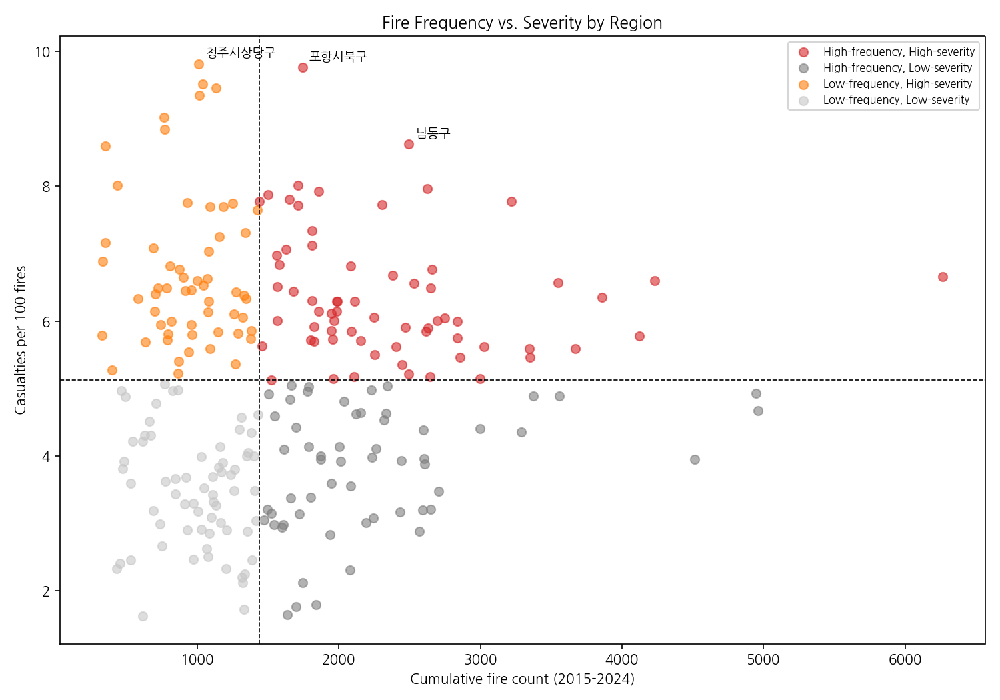

# Korea Fire Frequency-Severity Analysis

**Does fire frequency explain a region's damage risk?** Analysis of
10 years (2015–2024) of nationwide Korean fire statistics shows the
answer is largely no — fire frequency and per-fire casualty severity
are only weakly correlated, and a small number of regions show
persistently high casualty rates that volume-based prioritization
would miss entirely.

## Key Findings
- **Nationwide trend**: fire count down 11.7% (2015–17 avg vs
  2022–24 avg), while property damage rose 116.6% (nominal terms).
  Death counts were flat (+3.2%, not a meaningful trend).
- **Frequency and severity are only weakly related**: Spearman
  correlation between cumulative fire count and casualties-per-100-
  fires is ρ=0.10 (p=0.11, not significant) in the primary analysis,
  and ranges 0.05–0.21 across sampling thresholds — never strongly
  or consistently significant. Frequency alone is not a reliable
  predictor of casualty risk.
- **청주시상당구 (Cheongju Sangdang-gu) is the strongest individual
  case**: high-severity in both the 2015–19 and 2020–24 sub-periods,
  and shows ~1.6x excess casualty risk even after controlling for
  place-type composition (residential/industrial/etc.) and excluding
  its single worst incident. Not explained by chance, a mass-casualty
  outlier, or what kind of places its fires occur in.
- **24 regions** show excess risk ≥1.3x under the same place-mix
  control, forming a candidate priority list — though only 청주시상당구
  has been cross-validated against the time-period split.
- **Confirmed annual seasonality**: fires peak in March and winter
  months; STL decomposition and ACF (lag=12: ρ=0.49; lag=24: ρ=0.46,
  both significant at α=0.05) confirm this is a genuine recurring
  cycle, not noise in year-by-year averages.

## Repository Structure
notebooks/
├── 01_data_cleaning.ipynb # load, clean, unify 10 years of raw files
├── 02_temporal_analysis.ipynb # national trends, seasonality, STL/ACF
├── 03_frequency_vs_severity.ipynb # core correlation analysis, quadrant plot
├── 04_robustness_checks.ipynb # threshold sensitivity, period-split test
└── 05_excess_risk_analysis.ipynb # place-mix-controlled excess risk, priority list
docs/
├── project_charter.md
├── decision_log.md
├── data_inventory.md
├── data_dictionary.md
├── validation_log.md
└── ai_assistance.md
outputs/
├── figures/
└── tables/priority_regions.csv

## Data
**Source**: 소방청 (Korea National Fire Agency) 연간화재통계 (Annual Fire
Statistics), 2015–2024, published via [data.go.kr](https://www.data.go.kr).
Incident-level records (~406,000 rows) with date, region, ignition
source, place type, and casualty/property damage figures. Raw files
are not included in this repo; see `docs/data_inventory.md` for
download details.

## Methodology Highlights
- **Region identification bugs found and fixed**: yearly files used
  inconsistent column names (e.g. `일시` vs `화재발생년월일`), and
  district names alone are not unique identifiers — 중구 exists in 6
  different cities nationwide. An earlier version of this analysis
  compared regions by name only, causing two different cities to be
  miscounted as the same persistent region. Fixed by using
  `(시도, 시군구)` tuples throughout. See `04_robustness_checks.ipynb`.
- **Leave-one-out baseline**: when computing a region's "expected"
  casualty rate from national place-type statistics, that region's
  own data is excluded from the baseline to avoid its own extreme
  values inflating its own benchmark.
- **Worst-incident exclusion**: per-region statistics are recomputed
  excluding each region's single most severe incident, to confirm
  results aren't artifacts of one mass-casualty event (e.g. this
  ruled out 과천시 and 밀양시 as false positives — see
  `05_excess_risk_analysis.ipynb`).
- **Primary analysis + sensitivity checks**: main results use a
  300+ cumulative fires threshold (stated a priori); robustness
  confirmed at 200 and 500 as well.

## Limitations
- A weak correlation is not the same as no relationship — findings
  should be read as "fire frequency alone is an insufficient basis
  for prioritization," not "frequency is irrelevant."
- 23 of the 24 priority-list regions are flagged by the place-mix
  control only; only 청주시상당구 has been additionally verified
  against the 2015–19/2020–24 time-period split.
- Property damage figures are nominal (not inflation-adjusted).
- This project stops at identifying and characterizing the pattern.
  It does not build a predictive model — see Phase 2 below.

## Phase 2 (Planned)
Incorporate building age (건축물대장), elderly population ratio
(KOSIS), and fire station response distance as candidate explanatory
variables for the excess risk observed in priority regions, and test
whether they support a forecasting model.

## Reproducing This Analysis
Each notebook is self-contained after `01_data_cleaning.ipynb` has
been run once (it saves a cleaned dataset to Google Drive that later
notebooks load). Open in Colab via the badge at the top of each
notebook.

## AI Assistance
This project's analysis was developed with AI assistance (used for
statistical method suggestions, code review, and cross-checking
claims — including catching several bugs and unverified sources
along the way). See `docs/ai_assistance.md` for details.
